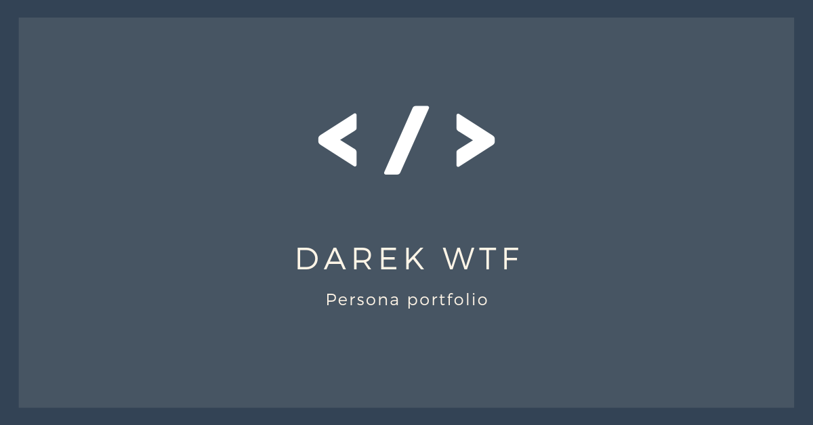

# Darek's persolal website

My persolal website build during WTF course 👍

# Tools and technologies I've used

- Visual Studio Code
- SASS
- Nod JS
- GULP
- Figma
- CSS grid, flexbox, Fetch API
- PWA

# biuld with wtf-gulp-starter

`npm install -g gulp-cli`

`npm install`

`gulp`

To publish your page using github pages use `npm run deploy`
